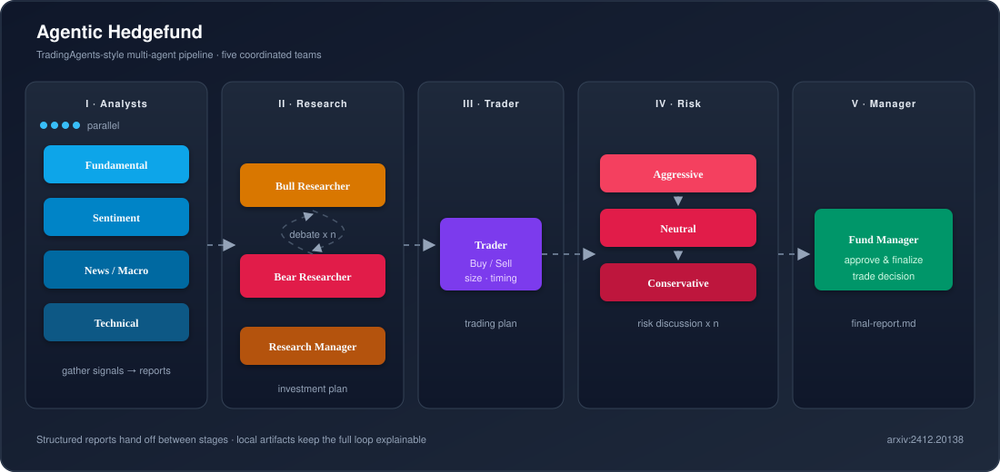

# Agentic Hedgefund

**Inspired from [TradingAgents: Multi-Agents LLM Financial Trading Framework](https://arxiv.org/pdf/2412.20138)**

Agentic processes can run a trading firm as a coordinated multi-agent pipeline.

Specialized analyst agents (fundamental, sentiment, news, technical) gather and report on market signals in parallel.

Bull and bear researchers debate those findings to surface a balanced view and a trader synthesizes the debate into buy/sell decisions with sizing and timing.

A risk team challenges the trading plan from aggressive, neutral, and conservative angles and finally a fund manager approves the final trade using structured reports for reliable handoffs.

All of these reasoning outputs are saved locally, so the whole loop stays explainable and closer to how real desks collaborate.

<p align="center">
  
</p>

> **Disclaimer:** This project is for research and educational use only. Outputs are generated by LLMs and are prone to hallucination. Nothing here is investment, legal, or tax advice, and nothing should be treated as a recommendation to buy, sell, or hold any security. You are solely responsible for any decisions you make. Past or simulated performance is not indicative of future results.

## Fork and Play

This project is setup in a way as to enable access to generate high quality research done at **absolutely zero cost** and **least possible effort**.

No local install, Docker, or API wiring required: defaults use free models, so you can fork and run from the browser alone within 5 mins.

### Step 1

Fork this repo and open the **Actions** tab.

### Step 2

Run **Publish image** workflow once. That builds the container and prepares it for Step 3.

### Step 3

Run **Ticker research** workflow, enter a stock ticker (e.g. `AAPL`), and start the workflow.

GitHub Actions runs the full multi-agent pipeline in the cloud, posts the final report to the job summary, makes available the source documents artifacts (downloadable as `.zip`). 

### Customise (Optional)

For more control, open your fork’s **Settings → Secrets and variables → Actions**.

**Secrets** (sensitive keys):


| Name                 | Purpose                                                                 |
| -------------------- | ----------------------------------------------------------------------- |
| `OPENCODE_API_KEY`   | Auth for OpenCode; required only for premium models      |
| `OPENROUTER_API_KEY` | Auth for OpenRouter; required only for premium models |
| `FRED_API_KEY`       | Macro data from FRED; set this for fuller news/macro analyst reports    |


**Variables** (non-secret model config, OpenCode `provider/model` format):


| Name                    | Role                     | Default               |
| ----------------------- | ------------------------ | --------------------- |
| `HEDGEFUND_QUICK_MODEL` | Fast / lighter reasoning | `opencode/big-pickle` |
| `HEDGEFUND_DEEP_MODEL`  | Deeper analysis          | `opencode/big-pickle` |
| `HEDGEFUND_EPIC_MODEL`  | Highest-stakes reasoning | `opencode/big-pickle` |


After saving, re-run **Ticker research**. The workflow injects these into the container automatically, no code or image changes needed.

## Advanced


### Run locally

You need [uv](https://docs.astral.sh/uv/) and Python ≥ 3.11. OpenCode runs via the SDK in subprocess mode by default (`opencode acp`)—no separate server required.

```bash
git clone https://github.com/<you>/hedgefund.git
cd hedgefund
cp .env.example .env   # fill OPENCODE_API_KEY / FRED_API_KEY as needed
uv sync --frozen
uv run --frozen python main.py AAPL
```

Useful flags:

```bash
uv run --frozen python main.py AAPL -d 2024-06-01          # trade date
uv run --frozen python main.py AAPL -o summary.md          # custom output path
uv run --frozen python main.py AAPL --debate-rounds 2      # bull/bear rounds
uv run --frozen python main.py AAPL --risk-rounds 2        # risk discussion rounds
```

The report lands at `out/<TICKER>/final-report.md` (plus per-agent markdown under that folder). Model tiers and keys use the same env vars as Actions (`HEDGEFUND_*_MODEL`, `OPENCODE_API_KEY`, `FRED_API_KEY`); set them in `.env` or your shell. Leave `OPENCODE_SERVER_URL` unset unless you want an external `opencode serve`.

### Develop further

Layout:


| Path            | Role                                                                         |
| --------------- | ---------------------------------------------------------------------------- |
| `main.py`       | CLI entrypoint                                                               |
| `pipeline.py`   | Orchestrates the four phases and stitches `final-report.md`                  |
| `phases/`       | Phase runners (reports → debate → trader → risk)                             |
| `agents/`       | Role prompts and agent logic (analysts, researchers, trader, risk, managers) |
| `config.py`     | Defaults and env-driven model/path settings                                  |
| `agent.py`      | OpenCode session helpers                                                     |
| `opencode.json` | OpenCode agent permissions and default model                                 |
| `memory/`       | Memory log / reflection used across runs                                     |


Typical loop: edit an agent prompt or phase under `agents/` / `phases/`, re-run `uv run --frozen python main.py <TICKER>`, inspect intermediate files under `out/<TICKER>/`. Bump debate or risk rounds from the CLI while iterating. When you change dependencies, update `pyproject.toml` and refresh the lock with `uv lock`, then `uv sync --frozen`.

**Merges to** `main` **rebuilds and pushes** `latest` **automatically.**
